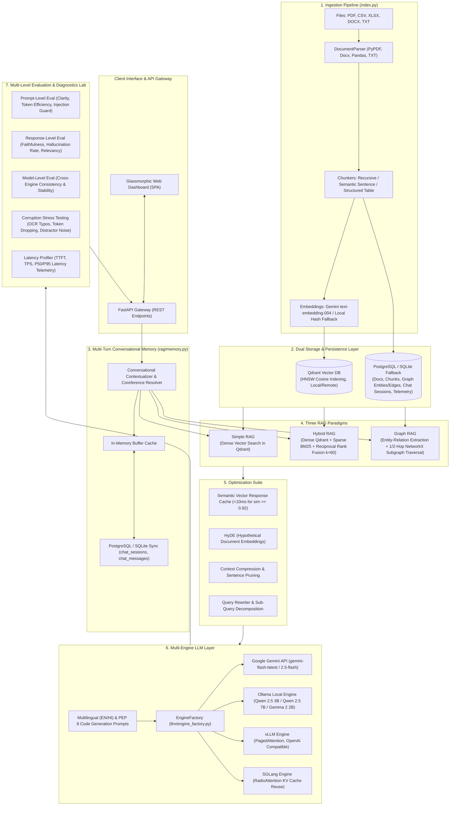

# OmniRAG: Multi-Format 3-Type Enterprise RAG Platform

OmniRAG is a production-ready, enterprise-grade Retrieval-Augmented Generation (RAG) platform supporting multi-format document ingestion (**PDF, CSV, XLSX, DOCX, TXT**), a resilient **Dual Database Layer** (**PostgreSQL** with automatic zero-friction **SQLite** fallback), high-performance **Qdrant Vector DB** (local & remote cloud), **3 distinct RAG architectures** (Simple RAG, Hybrid RAG with BM25 & Reciprocal Rank Fusion, and Graph RAG with NetworkX traversal), **Multi-Turn Conversational Session Memory** with automatic coreference resolution, and an end-to-end **Multi-Level Evaluation & Corruption Suite** with latency profiling.

OmniRAG features a unified multi-engine LLM tier powered by **Google Gemini API** (`gemini-flash-latest` / `gemini-2.5-flash`), on-device local **Ollama** models (**Qwen 2.5 3B**, **Qwen 2.5 7B**, and **Gemma 2 2B** for 100% offline, privacy-first CPU/GPU laptop inference), and high-throughput self-hosted engines: **vLLM** (PagedAttention) and **SGLang** (RadixAttention). It delivers native multilingual generation in **English**, fluent **Hindi (`हिन्दी`)**, and strict **PEP 8 Python code generation**.

---

## Complete System Architecture



---

## System Evolution & Comprehensive Changelog (From Inception to Completion)

The system evolved iteratively across 9 focused phases, transitioning from raw data handling to a fully enterprise-grade platform:

### Phase 1: Multi-Format Document Ingestion & Parsers (`index.py`, `create_samples.py`)
- **Multi-Format Extraction**: Built `DocumentParser` supporting **PDF** (`pypdf`), **CSV** (`pandas`), **XLSX** (`openpyxl`), **DOCX** (`python-docx`), and plain text **TXT**.
- **Specialized Chunking Strategies** (`rag/chunking.py`):
  - *Recursive Character Chunker*: Sliding-window text splitter with configurable overlap and hierarchical delimiters (`\n\n`, `\n`, `. `, ` `).
  - *Semantic Sentence Chunker*: Groups sentences respecting natural paragraph flow and discourse boundaries.
  - *Structured Document Chunker*: Formats tabular records into key-value context rows and maintains heading hierarchies.
- **Dual Embedding Providers** (`rag/embeddings.py`):
  - High-precision Google Gemini embeddings (`text-embedding-004` / `gemini-embedding-001`, 768 dimensions).
  - Deterministic 768-dimensional Local Fallback Embedder (`LocalFallbackEmbeddingProvider`) using feature hashing for instant offline execution and CI/CD pipelines without API quotas.
- **Sample Document Generator** (`create_samples.py`): Creates verified sample datasets in all 5 formats for testing.

### Phase 2: Dual Storage Layer & PostgreSQL Hardening (`database.py`, `setup_postgres.py`, `rag/vector_store.py`)
- **SQLAlchemy Schema Definition**: Established relational schemas for `DocumentModel`, `ChunkModel`, `GraphEntityModel`, `GraphRelationModel`, `QueryLogModel`, `EvaluationLogModel`, `BenchmarkLogModel`, `ChatSessionModel`, and `ChatMessageModel`.
- **Automated Fallback Architecture**: Built fail-safe database connection logic. If PostgreSQL is unavailable or unconfigured, the system automatically falls back to local SQLite at `./data/rag_app.db` without crashing.
- **PostgreSQL Setup Script** (`setup_postgres.py`): Automates connecting to local PostgreSQL as `postgres`, creates the `rag` database if missing, and initializes all tables and indices.
- **Qdrant Vector Database Integration** (`rag/vector_store.py`):
  - Local embedded disk storage at `./data/qdrant_storage` with auto-creation.
  - Remote Qdrant server connection via `QDRANT_URL` and `QDRANT_API_KEY`.
  - HNSW index with Cosine similarity distance metric.

### Phase 3: The Three RAG Paradigms (`rag/`)
- **Simple RAG** (`rag/simple_rag.py`): High-speed dense vector retrieval via Qdrant approximate nearest neighbor search + prompt augmentation.
- **Hybrid RAG** (`rag/hybrid_rag.py`, `rag/scoring.py`):
  - Parallel dense vector retrieval (Qdrant) and sparse token matching (`Rank-BM25`).
  - Score fusion via **Reciprocal Rank Fusion (RRF)**:
    $$RRF(d) = \sum_{m \in \{\text{dense}, \text{sparse}\}} \frac{1}{k + r_m(d)} \quad (k=60)$$
  - Contextual cross-reranking to eliminate false-positive keyword matches while retaining semantic intent.
- **Graph RAG** (`rag/graph_rag.py`):
  - Automated extraction of entity triples `(Subject, Relation, Object)` during indexing.
  - Storage in relational tables and a directed in-memory graph (`networkx.DiGraph`).
  - Multi-hop traversal: Discovers seed entities from queries, performs 1-hop and 2-hop neighborhood expansion, and synthesizes structured graph facts alongside dense text chunks.

### Phase 4: Multi-Engine LLM Adapters & Multilingual/Code Mode (`llm/`)
- **Unified Engine Factory** (`llm/engine_factory.py`):
  - `GeminiEngine`: Integration with Google GenAI API (`gemini-flash-latest`, `gemini-2.5-flash`) with retry mechanics and telemetry.
  - `OllamaEngine`: On-device local inference via OpenAI-compatible endpoint (`http://localhost:11434/v1`) running on laptop CPU, Intel Iris Xe, or NVIDIA GPU. Pre-configured with:
    - **Qwen 2.5 3B (`ollama:qwen2.5:3b`)**: Lightweight, highly efficient model optimized for fast CPU inference and multilingual English/Hindi comprehension.
    - **Qwen 2.5 7B (`ollama:qwen2.5vl:7b`)**: High-capacity reasoning model for deep analytical synthesis.
    - **Gemma 2 2B (`ollama:gemma2:2b`)**: Google's compact, fast 2-billion parameter on-device model.
    - Dynamic model routing: Pass any model tag via `backend="ollama:<model_name>"`.
  - `VLLMEngine`: Native client configured for local vLLM instances (`http://localhost:8000/v1`) using PagedAttention.
  - `SGLangEngine`: Native client configured for local SGLang instances (`http://localhost:30000/v1`) leveraging RadixAttention for KV-cache reuse.
- **Multilingual Support** (`llm/prompts.py`): Grounded responses in fluent **Hindi (`हिन्दी`)** using Devanagari script alongside standard English.
- **Python Code Generation Mode**: Strict system prompt enforcing PEP 8 compliance, clear docstrings, type annotations, and self-contained executable verification tests.

### Phase 5: Production Optimization Suite (`optimization/`)
- **Semantic Vector Response Cache** (`optimization/cache.py`): Caches query vectors and answers in memory. Any query with cosine similarity $\ge 0.92$ is returned immediately in **$<10\text{ ms}$** without querying the vector database or LLM.
- **Context Compression & Pruning** (`optimization/compression.py`): Context-aware sentence ranking to prune low-relevance passages before LLM synthesis, reducing token costs and latency.
- **HyDE (Hypothetical Document Embeddings)** (`optimization/hyde.py`): Synthesizes hypothetical answers for ambiguous questions to retrieve relevant documents in abstract domains.
- **Query Rewriting & Sub-Query Decomposition** (`optimization/query_rewriter.py`): Expands acronyms and decomposes multi-faceted questions into targeted sub-searches.

### Phase 6: Multi-Level Evaluation & Corruption Testing (`evaluation/`)
- **Prompt-Level Evaluation** (`evaluation/prompt_eval.py`): Evaluates question clarity, token density efficiency, and scans for adversarial prompt injection / jailbreak patterns.
- **Response-Level Evaluation** (`evaluation/response_eval.py`): Calculates factual Faithfulness against context chunks, Hallucination Rate ($1.0 - \text{Faithfulness}$), Answer Relevancy, and Format Adherence.
- **Model-Level Evaluation** (`evaluation/model_eval.py`): Quantifies output stability, cross-model drift, and response consistency.
- **Corruption Analysis Suite** (`evaluation/corruption.py`): Quantitative stress-testing injecting OCR typos, word omissions (10%-50%), and distractor noise across 0%, 25%, 50%, and 75% noise levels, computing a quantitative **Robustness Score** and degradation curve.
- **Latency & Telemetry Profiler** (`evaluation/latency_profiler.py`): Live tracking of TTFT (Time to First Token), retrieval latency, rerank time, total E2E latency, and token throughput (TPS).

### Phase 7: Multi-Turn Conversational Session Memory (`rag/memory.py`)
- **In-Memory Cache + Relational DB Sync**: Session state maintained in high-speed Python memory buffers and automatically synchronized with PostgreSQL/SQLite (`chat_sessions` and `chat_messages` tables).
- **Contextual Coreference & Pronoun Resolution**: Detects anaphoric references (e.g., Turn 1: *"What is Qdrant?"*, Turn 2: *"Does it support local disk storage?"*) and automatically resolves *"it"* to *Qdrant* before search retrieval.
- **Sliding-Window Context Injection**: Formats recent user and assistant dialogue turns into the LLM synthesis context.

### Phase 8: Sleek Glassmorphic Web Dashboard UI (`main.py`)
- **Full-Featured Single Page Application (SPA)**: Built directly into FastAPI, featuring modern glassmorphic aesthetics, responsive sidebar navigation, real-time stats cards, and 6 specialized application tabs:
  1. *Chat & Query Studio*: Multi-turn dialogue, session manager, RAG paradigm switcher, engine selector, language toggle, and expandable source citations.
  2. *Document Ingestion Hub*: Drag-and-drop file upload for PDF, CSV, XLSX, DOCX, TXT with strategy selectors and status indicators.
  3. *Knowledge Graph Visualizer*: Interactive network graph visualizing entities, relationships, edge weights, and graph degree metrics.
  4. *Multi-Level Evaluation Lab*: Live prompt and response evaluation with metric breakdowns.
  5. *Corruption Analysis Lab*: Interactive stress-testing showing resilience scores and degradation charts across noise levels.
  6. *Telemetry & Benchmarking*: Real-time latency breakdowns, TTFT, TPS, P95 metrics, and semantic cache controls.

### Phase 9: Automated Test Suite & Quality Verification (`tests/test_all.py`)
- Comprehensive test suite featuring **10 automated tests** covering parsers, chunkers, embeddings, Qdrant vector storage, BM25 scoring, RRF, all 3 RAG types, Hindi & code mode, evaluation, corruption analysis, semantic cache, API endpoints, and multi-turn conversational memory.

---

## Directory & File Structure

```
RAG_FINAL_PROJECT/
├── main.py                     # FastAPI server, REST API endpoints & Glassmorphic Web Dashboard
├── index.py                    # Multi-format document parser & indexing pipeline (CLI + Module)
├── database.py                 # PostgreSQL & SQLite SQLAlchemy models, schemas, and fallback logic
├── setup_postgres.py           # Automated PostgreSQL database initialization & table setup script
├── create_samples.py           # Synthetic sample generator for PDF, CSV, XLSX, DOCX, TXT
├── OmniRAG.postman_collection.json # Ready-to-import Postman Collection with all pre-configured endpoints
├── OmniRAG_Complete_User_and_API_Guide.docx # Professional, beautifully styled Word documentation guide
├── INSTALLATION_GUIDE.md        # Comprehensive multi-machine installation, coding & onboarding guide
├── requirements.txt            # Production-tested Python dependencies
├── .env.example                # Environment variables configuration template
├── .env                        # Local active configuration (Gemini API key, DB URLs, etc.)
├── README.md                   # Complete architectural, operational, and API documentation
├── walkthrough.md              # Detailed walkthrough and verification report
├── implementation_plan.md      # Engineering architecture and design specification
│
├── rag/                        # Core Retrieval-Augmented Generation Engines
│   ├── __init__.py
│   ├── chunking.py             # Recursive, Semantic Sentence, and Structured (Table/Heading) chunkers
│   ├── embeddings.py           # Gemini text-embedding-004 & Local Fallback hashing embedder
│   ├── vector_store.py         # Qdrant client, collections, indexing, and HNSW cosine search
│   ├── scoring.py              # Cosine similarity, BM25Okapi, Reciprocal Rank Fusion (RRF), Reranker
│   ├── simple_rag.py           # Simple RAG pipeline (Dense Vector Search)
│   ├── hybrid_rag.py           # Hybrid RAG pipeline (Dense Qdrant + Sparse BM25 + RRF)
│   ├── graph_rag.py            # Graph RAG pipeline (Entity-Relation Extraction + NetworkX Traversal)
│   └── memory.py               # Multi-turn conversational session memory & coreference contextualizer
│
├── llm/                        # Language Model Layer & Multi-Engine Adapters
│   ├── __init__.py
│   ├── prompts.py              # English, Hindi, Python coding, and KG entity extraction prompts
│   ├── gemini_client.py        # Gemini API wrapper with token usage & TTFT latency telemetry
│   ├── engine_factory.py       # Unified engine factory for Gemini, Ollama (Qwen 2.5 / Gemma 2), vLLM, and SGLang
│
├── optimization/               # Performance & Speed Optimization Suite
│   ├── __init__.py
│   ├── cache.py                # In-memory Vector Semantic Response Cache (<10ms for sim >= 0.92)
│   ├── query_rewriter.py       # Query expansion and sub-query decomposition
│   ├── hyde.py                 # Hypothetical Document Embeddings (HyDE)
│   └── compression.py          # Context compression and sentence pruning
│
├── evaluation/                 # Multi-Level Evaluation & Diagnostics Lab
│   ├── __init__.py
│   ├── prompt_eval.py          # Prompt clarity, token efficiency, and injection guard
│   ├── response_eval.py        # Faithfulness, hallucination rate, answer relevancy, format adherence
│   ├── model_eval.py           # Cross-model benchmark & stability/drift metrics
│   ├── corruption.py           # Corruption stress testing (OCR typos, token omission, distractors)
│   ├── latency_profiler.py     # Average latency, TTFT, TPS, and percentile profiling
│   └── evaluator.py            # Unified evaluation orchestrator
│
├── data/                       # Local Storage & Datasets
│   ├── uploads/                # User-uploaded files
│   ├── samples/                # Sample test documents in all 5 formats
│   ├── qdrant_storage/         # Local Qdrant persistent vector database
│   └── rag_app.db              # Local SQLite database fallback
│
└── tests/
    └── test_all.py             # 10 comprehensive automated unit and integration tests
```

---

## Detailed Specifications of the 3 RAG Paradigms

### 1. Simple RAG (`rag/simple_rag.py`)
- **Mechanism**: Converts the incoming query into a 768-dimensional dense vector $\vec{q}$, executes approximate nearest neighbor search (HNSW) in Qdrant, retrieves top-$k$ chunks based on cosine similarity:
  $$\text{Cosine Similarity} = \frac{\vec{q} \cdot \vec{d}}{\|\vec{q}\| \|\vec{d}\|}$$
- **Best Suited For**: General semantic queries, conceptual thematic research, and low-complexity document lookup.

### 2. Hybrid RAG (`rag/hybrid_rag.py`)
- **Mechanism**: Executes parallel dual-stream retrieval:
  1. *Dense Stream*: Qdrant vector similarity search for semantic meaning.
  2. *Sparse Stream*: BM25Okapi scoring across tokenized inverted indices for exact keyword matches.
- **Fusion Algorithm**: Merges ranked results via Reciprocal Rank Fusion (RRF):
  $$RRF(d) = \frac{1}{60 + r_{\text{dense}}(d)} + \frac{1}{60 + r_{\text{sparse}}(d)}$$
- **Cross-Reranker**: Normalizes dense and sparse scores to rank true matches above keyword collisions.
- **Best Suited For**: Domain-specific corpora containing part numbers, financial codes, acronyms, product catalogs, and precise terminology.

### 3. Graph RAG (`rag/graph_rag.py`)
- **Mechanism**:
  1. Extracts entities (e.g., `TECHNOLOGY`, `ORGANIZATION`, `METRIC`) and relationship predicates during document indexing.
  2. Persists graph topology in relational tables (`graph_entities`, `graph_relations`) and an active directed graph (`networkx.DiGraph`).
  3. At query time, extracts seed entities from the question and performs 1-hop and 2-hop neighborhood expansion.
  4. Fuses structured graph relation paths (e.g., `(Qdrant)-[USES]->(HNSW Index)`) with dense text passages.
- **Best Suited For**: Multi-hop associative reasoning, structural dependency tracing, and complex causal queries across disparate documents.

---

## Multi-Engine LLM Tier & Local Ollama Models

OmniRAG integrates a pluggable **Engine Factory** ([`llm/engine_factory.py`](file:///c:/Users/deepa/OneDrive/Desktop/AI%20ML%20DATASET/RAG_FINAL_PROJECT/llm/engine_factory.py)) that supports both state-of-the-art cloud APIs and zero-latency, 100% offline local inference engines.

### 1. Supported Engine Backends

| Backend Engine | Mode | Execution Environment | Best For |
|---|---|---|---|
| **Google Gemini API** (`gemini`) | Cloud API | Google AI Infrastructure | Complex multi-modal reasoning, native Hindi, and high-throughput production. |
| **Ollama Local Engine** (`ollama:*`) | Local On-Device | CPU, Intel Iris Xe, Apple Silicon, or NVIDIA GPU | 100% privacy, air-gapped deployments, zero API quotas, and offline laptop operation. |
| **vLLM** (`vllm`) | Self-Hosted | Linux / NVIDIA GPU Server | PagedAttention continuous batching for enterprise-scale concurrency. |
| **SGLang** (`sglang`) | Self-Hosted | Linux / NVIDIA GPU Server | RadixAttention with automatic KV-cache reuse across multi-turn RAG conversations. |

### 2. Supported Local Ollama Models

OmniRAG comes pre-configured with three specialized on-device models, selectable from the Web Dashboard dropdown or the REST API:

1. **Qwen 2.5 3B (`ollama:qwen2.5:3b`) - Recommended Default Local Model**:
   - **Footprint**: ~2.0 GB VRAM / RAM.
   - **Hardware**: Extremely fast on standard laptop CPUs and Intel Iris Xe integrated graphics.
   - **Strengths**: Exceptional multilingual comprehension (fluent in English and Hindi), strong instruction adherence, and fast retrieval synthesis.
2. **Qwen 2.5 7B (`ollama:qwen2.5vl:7b` / `ollama:qwen2.5:7b`)**:
   - **Footprint**: ~4.5–6.0 GB VRAM / RAM.
   - **Hardware**: Dedicated GPU or 16GB+ RAM laptop.
   - **Strengths**: High-capacity analytical reasoning, deep technical comprehension, and complex multi-document summarization.
3. **Gemma 2 2B (`ollama:gemma2:2b`)**:
   - **Footprint**: ~1.6 GB VRAM / RAM.
   - **Hardware**: Low-power laptops, edge devices, and memory-constrained environments.
   - **Strengths**: Developed by Google DeepMind; provides rapid token generation for fast Q&A and factual lookups.

### 3. Dynamic Model Routing Syntax
You can pass any Ollama model tag dynamically at query time without restarting the server:
- `backend: "ollama:qwen2.5:3b"`
- `backend: "ollama:qwen2.5vl:7b"`
- `backend: "ollama:gemma2:2b"`
- `backend: "ollama:llama3.1:8b"` *(or any other model pulled into your local Ollama instance)*

### 4. How to Run Ollama Locally
```bash
# 1. Download and install Ollama from https://ollama.com
# 2. Pull the recommended models:
ollama pull qwen2.5:3b
ollama pull qwen2.5vl:7b
ollama pull gemma2:2b

# 3. Start the Ollama local daemon:
ollama serve
# (Listens on http://localhost:11434 by default)
```
In your `.env` file, configure:
```env
OLLAMA_API_BASE=http://localhost:11434/v1
OLLAMA_MODEL=qwen2.5:3b
LLM_BACKEND=ollama:qwen2.5:3b
```
Now all RAG queries will execute entirely on your local machine with zero external API calls!

---

## Multi-Turn Conversational Memory & Coreference Resolution

Implemented in [`rag/memory.py`](file:///c:/Users/deepa/OneDrive/Desktop/AI%20ML%20DATASET/RAG_FINAL_PROJECT/rag/memory.py):
1. **Session Lifecycle**: Each conversation is tracked under a unique `session_id`. Sessions can be initiated, viewed, and cleared via REST endpoints or the web dashboard.
2. **Contextual Query Reformulation**: Solves follow-up query ambiguity and pronoun references:
   - *Turn 1 User*: "What is Qdrant?" $\to$ *Assistant*: Explains Qdrant vector database.
   - *Turn 2 User*: "Does it support local disk storage?"
   - *Contextualizer*: Detects reference trigger words (`it`, `they`, `that`, `this`, `what about`) and expands the query to `[Context: What is Qdrant?] Does it support local disk storage?`, ensuring the vector search retrieves chunks about Qdrant rather than generic storage.
3. **Dialogue Context Injection**: Injects a sliding window of recent dialogue turns into the system prompt, allowing the LLM to sustain natural conversation threads.

---

## Multi-Level Evaluation & Corruption Stress Testing

### 1. Prompt-Level Evaluation (`evaluation/prompt_eval.py`)
- **Clarity Score** ($0.0 - 1.0$): Measures question specificity, structural balance, and penalizes vague queries.
- **Token Efficiency**: Evaluates information density versus token redundancy.
- **Prompt Injection Guard**: Detects adversarial jailbreak patterns, system prompt overrides, and delimiters.

### 2. Response-Level Evaluation (`evaluation/response_eval.py`)
- **Faithfulness Score** ($0.0 - 1.0$): Evaluates factual grounding against context chunks.
- **Hallucination Rate**: Computes $1.0 - \text{Faithfulness}$.
- **Answer Relevancy**: Semantic cosine similarity between query and generated response.
- **Format Adherence**: Verifies compliance with requested format constraints (e.g., Markdown Python code blocks or Hindi Devanagari script).

### 3. Corruption Stress Testing (`evaluation/corruption.py`)
Simulates real-world data corruption across **0%, 25%, 50%, and 75%** noise levels:
- **OCR Character Noise**: Random character swaps, typos, and visual OCR substitutions (e.g., `o` $\to$ `0`, `l` $\to$ `1`).
- **Token Omission**: Random dropping of 10% to 50% of informative tokens.
- **Distractor Injection**: Insertion of irrelevant text paragraphs to simulate noisy web scrapes or bad OCR blocks.
- **Output**: Computes a quantitative **Robustness Score** and plots a degradation curve.

### 4. Latency & Telemetry Profiling (`evaluation/latency_profiler.py`)
- **TTFT (Time to First Token)**: Latency until the initial token is received.
- **Subsystem Breakdown**: Dense retrieval time, BM25 search time, RRF fusion time, LLM generation time, and total E2E latency.
- **Throughput**: Real-time Tokens Per Second (TPS).
- **Percentiles**: Rolling calculation of P50, P95, and P99 latency.

---

## Quick Start & Installation Guide

> [!TIP]
> **Moving to a new computer or setting up development from scratch?**
> Check out the complete, step-by-step **[INSTALLATION_GUIDE.md](file:///c:/Users/deepa/OneDrive/Desktop/AI%20ML%20DATASET/RAG_FINAL_PROJECT/INSTALLATION_GUIDE.md)** for detailed operating-system-specific commands (Windows/macOS/Linux), developer extension recipes, and common troubleshooting solutions.

### Prerequisites
- Python 3.10, 3.11, or 3.12 (Python 3.11 recommended)
- Git
- Google Gemini API Key (or use the built-in offline local fallback)
- *(Optional)* PostgreSQL 14+ (Not required: the system includes automatic zero-config SQLite fallback)

### 1. Clone & Set Up Virtual Environment
```bash
# Clone the repository
git clone <repo-url>
cd RAG_FINAL_PROJECT

# Create virtual environment
python -m venv venv

# Activate virtual environment
# Windows (PowerShell):
.\venv\Scripts\activate
# Windows (cmd.exe):
# .\venv\Scripts\activate.bat
# macOS / Linux:
# source venv/bin/activate

# Upgrade pip & install all dependencies
python -m pip install --upgrade pip
pip install -r requirements.txt
```

### 2. Configure Environment Variables (`.env`)
Create your `.env` file from the provided template:
```bash
# Windows:
Copy-Item .env.example .env
# macOS / Linux:
# cp .env.example .env
```
Edit `.env` to configure your keys and preferences:
```env
# Google Gemini API
GEMINI_API_KEY=your_gemini_api_key_here
GEMINI_MODEL=gemini-flash-latest

# Database Configuration (PostgreSQL with automatic SQLite fallback)
POSTGRES_USER=postgres
POSTGRES_PASSWORD=sa
POSTGRES_HOST=localhost
POSTGRES_PORT=5432
POSTGRES_DB=rag
# Or explicit URL:
DATABASE_URL=postgresql://postgres:sa@localhost:5432/rag

# Qdrant Vector Store (Local embedded directory or remote cloud)
QDRANT_PATH=./data/qdrant_storage
# QDRANT_URL=http://localhost:6333

# Optional Local On-Device Ollama Engine (100% Offline on Laptop CPU/GPU)
OLLAMA_API_BASE=http://localhost:11434/v1
OLLAMA_MODEL=qwen2.5:3b
# LLM_BACKEND=ollama:qwen2.5:3b

# Optional Self-Hosted Inference Engines
VLLM_API_BASE=http://localhost:8000/v1
VLLM_MODEL=meta-llama/Llama-3.1-8B-Instruct
SGLANG_API_BASE=http://localhost:30000/v1
SGLANG_MODEL=meta-llama/Llama-3.1-8B-Instruct
```

### 3. Initialize PostgreSQL Database (Optional)
If running local PostgreSQL, initialize the database and tables with one command:
```bash
python setup_postgres.py
```
*(If PostgreSQL is not running, the application automatically boots with local SQLite without requiring configuration).*

### 4. Generate Sample Test Documents
Create sample test files across all 5 supported formats (PDF, CSV, XLSX, DOCX, TXT):
```bash
python create_samples.py
```

### 5. Ingest and Index Documents
Index all generated sample documents into Qdrant and the relational database:
```bash
python index.py --all-samples
```
To index an individual file with custom chunking and embedding settings:
```bash
python index.py --file ./data/samples/executive_summary.pdf --chunker semantic --embedder gemini
```

### 6. Run Automated Quality & Test Suite
Execute the full test suite (10 automated tests):
```bash
python -m unittest tests/test_all.py
```

### 7. Launch the Application & Web Dashboard
```bash
python main.py
```
Access the application:
- **Interactive Glassmorphic Web Dashboard**: [http://127.0.0.1:8000](http://127.0.0.1:8000)
- **Interactive OpenAPI / Swagger Documentation**: [http://127.0.0.1:8000/docs](http://127.0.0.1:8000/docs)

---

## Interactive Swagger UI Documentation Guide (`/docs`)

OmniRAG automatically generates an interactive, OpenAPI 3.1 compliant **Swagger UI** that provides a complete, zero-setup testing sandbox directly inside your browser.

### 1. Accessing Swagger UI
1. Start the application: `python main.py`
2. Open your browser and navigate to: **[http://127.0.0.1:8000/docs](http://127.0.0.1:8000/docs)**
3. Alternatively, access the 3-pane reference documentation via ReDoc: **[http://127.0.0.1:8000/redoc](http://127.0.0.1:8000/redoc)**
4. Inspect the raw OpenAPI specification schema at: **[http://127.0.0.1:8000/openapi.json](http://127.0.0.1:8000/openapi.json)**

### 2. Anatomy of the Swagger Interface
- **Endpoint Groups**: Endpoints are logically categorized (`/api/health`, `/api/upload`, `/api/query`, `/api/evaluate`, `/api/corruption-test`, `/api/documents`, `/api/graph`, `/api/benchmark`, `/api/sessions`, `/api/cache/clear`).
- **Interactive "Try it out" Mode**: Every endpoint features an interactive **Try it out** button that enables you to modify parameters, upload files, customize JSON payloads, and execute live API calls.
- **Pydantic Data Schemas**: Scroll to the **Schemas** section at the bottom of the page to inspect data models, validation constraints (e.g. `top_k` between 1 and 20, `hop_depth` between 1 and 3), required fields, and default values.

### 3. Step-by-Step Swagger UI Tutorials

#### A. Ingesting Documents with Custom Strategies (`POST /api/upload`)
1. In Swagger UI, click to expand **`POST /api/upload`**.
2. Click the white **Try it out** button on the top right of the accordion.
3. Under the `file` field, click **Choose File** and select any file (`.pdf`, `.csv`, `.xlsx`, `.docx`, or `.txt`).
4. Configure ingestion parameters:
   - `chunking_strategy`: Enter `semantic` (or `recursive` / `structured`).
   - `embedding_strategy`: Enter `gemini` (or `local` for offline testing).
   - `chunk_size`: Set chunk character size (default: `500`).
   - `chunk_overlap`: Set sliding-window overlap (default: `100`).
   - `extract_graph`: Set to `true` to extract entity-relationship triples for Graph RAG.
5. Click the blue **Execute** button.
6. Under **Responses**, observe the HTTP 200 result containing document ID, total chunk count, extracted entities, and relations.

#### B. Querying RAG Paradigms & Multilingual Modes (`POST /api/query`)
1. Expand **`POST /api/query`** and click **Try it out**.
2. Customize the JSON request body:
   ```json
   {
     "query": "What are the core differences between Simple, Hybrid, and Graph RAG?",
     "rag_type": "hybrid",
     "backend": "gemini",
     "language": "en",
     "mode": "general",
     "top_k": 4,
     "use_cache": true,
     "compress_context": false,
     "session_id": "swagger_demo_session"
   }
   ```
3. Click **Execute**.
4. Inspect the response payload:
   - `answer`: Grounded synthesis from the selected LLM engine.
   - `sources`: Array of retrieved chunks with Reciprocal Rank Fusion (`rrf_score`) and reranking scores.
   - `telemetry`: Precise millisecond timings (`dense_retrieval_ms`, `sparse_search_ms`, `generation_latency_ms`, `total_latency_ms`), TTFT, and tokens per second.

#### C. Testing Multi-Turn Conversational Dialogue in Swagger UI
1. In `POST /api/query`, set `"session_id": "team_chat_1"`.
2. **Turn 1**: Submit query `"What is Qdrant?"` and click **Execute**.
3. **Turn 2**: Immediately submit follow-up query `"Does it support local disk storage?"` with the **same** `"session_id": "team_chat_1"`.
4. Observe that the contextualizer automatically resolves *"it"* to *Qdrant* before search retrieval, and recent turns are injected into the prompt context.

#### D. Running Multi-Level Evaluation in Swagger UI (`POST /api/evaluate`)
1. Expand **`POST /api/evaluate`** and click **Try it out**.
2. Supply a question, generated answer, and context passages:
   ```json
   {
     "query": "How does Qdrant perform similarity search?",
     "response": "Qdrant uses HNSW indexing for cosine vector search.",
     "context_passages": ["Qdrant provides high performance vector search using HNSW graphs."],
     "rag_type": "simple",
     "run_corruption_test": true
   }
   ```
3. Click **Execute** to view Prompt Clarity, Injection Safety, Faithfulness, Hallucination Rate, and Answer Relevancy scores.

---

## Postman Application Guide & Pre-Built Collection

OmniRAG includes an official, ready-to-import Postman Collection: [`OmniRAG.postman_collection.json`](file:///c:/Users/deepa/OneDrive/Desktop/AI%20ML%20DATASET/RAG_FINAL_PROJECT/OmniRAG.postman_collection.json). It contains pre-configured requests, environment variables, headers, and sample JSON payloads for every endpoint.

### 1. Option A: One-Click Import (Recommended)
1. Open the **Postman** desktop application.
2. Click the **Import** button in the top-left navigation pane.
3. Drag and drop **`OmniRAG.postman_collection.json`** (located in your project root) into the Postman window.
4. Click **Import**.
5. The collection **OmniRAG Enterprise Platform API** will appear with 6 neatly categorized folders:
   - **`1. System & Health`**: Health Check, Latency & Telemetry Benchmarks.
   - **`2. Document Ingestion`**: Multipart File Upload, List Indexed Documents.
   - **`3. RAG Querying & Synthesis`**: Hybrid RAG, Simple RAG, Graph RAG, Hindi Multilingual, Python Code Mode, Multi-Turn turns.
   - **`4. Conversational Session Memory`**: List Sessions, Get Session History, Delete Session.
   - **`5. Evaluation & Diagnostics`**: Multi-Level Evaluation, Corruption Stress Test, Knowledge Graph Topology.
   - **`6. Optimization & Cache`**: Clear Semantic Vector Cache.

### 2. Option B: Live OpenAPI Schema Import via URL
1. In Postman, click **Import**.
2. Select the **Link** tab.
3. Paste: `http://127.0.0.1:8000/openapi.json`
4. Click **Continue** $\to$ **Import**.
5. Postman will automatically generate requests and request bodies mapped to every endpoint.

### 3. Postman Collection Variables
The collection includes pre-configured collection variables so you never have to hardcode URLs:
| Variable | Default Value | Description |
|---|---|---|
| `{{base_url}}` | `http://127.0.0.1:8000` | Host and port of the running FastAPI server |
| `{{session_id}}` | `postman_demo_session` | Default session identifier for multi-turn conversational testing |

### 4. Step-by-Step Endpoint Testing in Postman

#### Request 1: Health Check (`GET {{base_url}}/api/health`)
- Select `1. System & Health` $\to$ `Health Check & System Status`.
- Click **Send**.
- **Expected Response (HTTP 200)**:
  ```json
  {
    "status": "online",
    "service": "Multi-Format 3-Type RAG API",
    "qdrant_points": 43,
    "semantic_cache_size": 2,
    "graph_nodes": 12,
    "graph_edges": 15
  }
  ```

#### Request 2: Multipart Document Upload (`POST {{base_url}}/api/upload`)
- Select `2. Document Ingestion` $\to$ `Upload & Index Document`.
- Under the **Body** tab, verify **form-data** is selected.
- In the `file` key, hover over the value cell, click **Select Files**, and choose your test file (e.g. `./data/samples/executive_summary.pdf`).
- Verify options: `chunking_strategy` (`semantic`), `embedding_strategy` (`gemini`), `chunk_size` (`500`), `extract_graph` (`true`).
- Click **Send**.
- **Expected Response (HTTP 200)**:
  ```json
  {
    "status": "success",
    "document_id": 6,
    "filename": "executive_summary.pdf",
    "chunks_indexed": 3,
    "entities_extracted": 4,
    "relations_extracted": 5
  }
  ```

#### Request 3: Hybrid RAG Query (`POST {{base_url}}/api/query`)
- Select `3. RAG Querying & Synthesis` $\to$ `Query: Hybrid RAG`.
- Under **Body** $\to$ **raw (JSON)**:
  ```json
  {
    "query": "What are the core differences between Simple, Hybrid, and Graph RAG?",
    "rag_type": "hybrid",
    "backend": "gemini",
    "language": "en",
    "mode": "general",
    "top_k": 4,
    "use_cache": true
  }
  ```
- Click **Send**.
- Inspect the generated answer, citations, and telemetry in the response pane.

#### Request 4: Multi-Turn Conversational Dialogue in Postman
- **Step 1 (Turn 1)**: Select `Query: Conversational Turn 1 (Initialize Session)`.
  - Body: `{"query": "What is Qdrant?", "session_id": "{{session_id}}", "rag_type": "hybrid"}`
  - Click **Send**.
- **Step 2 (Turn 2)**: Select `Query: Conversational Turn 2 (Coreference Resolution)`.
  - Body: `{"query": "Does it support local disk storage?", "session_id": "{{session_id}}", "rag_type": "hybrid"}`
  - Click **Send**.
- **Step 3 (Inspect History)**: Select `4. Conversational Session Memory` $\to$ `Get Session Conversation History`.
  - Click **Send**. You will see all recorded turns, assistant responses, and source references stored in the database.

#### Request 5: Multilingual Hindi Query (`POST {{base_url}}/api/query`)
- Select `Query: Multilingual Hindi Generation`.
- Body:
  ```json
  {
    "query": "RAG आर्किटेक्चर के मुख्य लाभ क्या हैं?",
    "rag_type": "hybrid",
    "language": "hi",
    "mode": "general"
  }
  ```
- Click **Send**. Output will be synthesized in fluent Hindi in Devanagari script.

#### Request 6: Python Code Generation (`POST {{base_url}}/api/query`)
- Select `Query: Python Code Generation Mode`.
- Body:
  ```json
  {
    "query": "Write a Python function to compute Reciprocal Rank Fusion given two ranked lists",
    "rag_type": "hybrid",
    "mode": "code"
  }
  ```
- Click **Send**. Generates clean, type-annotated, PEP 8 compliant Python code with verification assertions.

#### Request 7: Local Ollama Model Query (`POST {{base_url}}/api/query`)
- Select `3. RAG Querying & Synthesis` $\to$ `Query: Local Ollama Model (Qwen 2.5 / Gemma 2)`.
- Under **Body** $\to$ **raw (JSON)**:
  ```json
  {
    "query": "What are the core differences between Simple, Hybrid, and Graph RAG?",
    "rag_type": "hybrid",
    "backend": "ollama:qwen2.5:3b",
    "language": "en",
    "mode": "general",
    "top_k": 3
  }
  ```
- Click **Send**. The query runs completely offline on your local machine using the Qwen 2.5 3B model without using any cloud API quota.

---

## Professional Word Documentation Guide (`.docx`)

For offline presentations, executive reviews, and developer onboarding, a professionally styled Microsoft Word document has been compiled and saved in the project root:

📄 **[`OmniRAG_Complete_User_and_API_Guide.docx`](file:///c:/Users/deepa/OneDrive/Desktop/AI%20ML%20DATASET/RAG_FINAL_PROJECT/OmniRAG_Complete_User_and_API_Guide.docx)**

### Design & Structure Highlights of the Word Document:
- **Executive Styling**: Tailored navy and slate-blue color scheme (`#1A365D` / `#2B6CB0`) with professional typography, clean margins, and clear visual hierarchy.
- **Visual Callout Boxes**: Left-bordered accent callouts for Pro Tips, quick-access URLs, and architectural notes.
- **Comparative Data Tables**: Beautifully shaded header rows and alternating striping comparing Simple RAG vs. Hybrid RAG vs. Graph RAG, Swagger UI operations, Postman workflows, and evaluation metric definitions.
- **Code Listings**: Formatted monospace Consolas code blocks with soft gray background boxes for cURL commands, Postman JSON bodies, and configuration scripts.
- **Complete Verification Matrix**: Full sign-off table documenting the status of all 10 automated test suites.

---

## REST API Reference & Examples

### 1. Execute Query (`POST /api/query`)
Executes a RAG query using Simple, Hybrid, or Graph RAG with conversational session memory:
```bash
curl -X POST "http://127.0.0.1:8000/api/query" \
  -H "Content-Type: application/json" \
  -d '{
    "query": "What are the core differences between Simple, Hybrid, and Graph RAG?",
    "rag_type": "hybrid",
    "backend": "gemini",
    "language": "en",
    "mode": "general",
    "top_k": 4,
    "use_cache": true,
    "session_id": "demo_session_1"
  }'
```

### 2. Follow-Up Query with Coreference Resolution
```bash
curl -X POST "http://127.0.0.1:8000/api/query" \
  -H "Content-Type: application/json" \
  -d '{
    "query": "Does it support local disk persistence?",
    "rag_type": "hybrid",
    "session_id": "demo_session_1"
  }'
```

### 3. Hindi Multilingual Query (`POST /api/query`)
```bash
curl -X POST "http://127.0.0.1:8000/api/query" \
  -H "Content-Type: application/json" \
  -d '{
    "query": "हाइब्रिड RAG और ग्राफ RAG की मुख्य विशेषताएं क्या हैं?",
    "rag_type": "graph",
    "language": "hi"
  }'
```

### 4. Python Code Generation Mode (`POST /api/query`)
```bash
curl -X POST "http://127.0.0.1:8000/api/query" \
  -H "Content-Type: application/json" \
  -d '{
    "query": "Write a Python function to calculate Reciprocal Rank Fusion",
    "rag_type": "hybrid",
    "mode": "code"
  }'
```

### 5. Local On-Device Query via Ollama (`POST /api/query`)
Execute 100% offline queries using local laptop models (**Qwen 2.5 3B**, **Qwen 2.5 7B**, or **Gemma 2 2B**):
```bash
curl -X POST "http://127.0.0.1:8000/api/query" \
  -H "Content-Type: application/json" \
  -d '{
    "query": "What are the core differences between Simple, Hybrid, and Graph RAG?",
    "rag_type": "hybrid",
    "backend": "ollama:qwen2.5:3b",
    "language": "en",
    "top_k": 3
  }'
```

### 6. Document Upload & Ingestion (`POST /api/upload`)
Upload and index any PDF, CSV, XLSX, DOCX, or TXT file:
```bash
curl -X POST "http://127.0.0.1:8000/api/upload" \
  -F "file=@./data/samples/system_specifications.docx" \
  -F "chunking_strategy=semantic" \
  -F "embedding_strategy=gemini" \
  -F "chunk_size=500" \
  -F "chunk_overlap=100" \
  -F "extract_graph=true"
```

### 6. List Active Documents (`GET /api/documents`)
```bash
curl -X GET "http://127.0.0.1:8000/api/documents"
```

### 7. Run Multi-Level Evaluation (`POST /api/evaluate`)
```bash
curl -X POST "http://127.0.0.1:8000/api/evaluate" \
  -H "Content-Type: application/json" \
  -d '{
    "query": "How does Qdrant perform similarity search?",
    "response": "Qdrant uses HNSW indexing for cosine vector search.",
    "context_passages": ["Qdrant provides high performance vector search using HNSW graphs."],
    "rag_type": "simple",
    "run_corruption_test": true
  }'
```

### 8. Run Corruption Stress Test (`POST /api/corruption-test`)
```bash
curl -X POST "http://127.0.0.1:8000/api/corruption-test" \
  -H "Content-Type: application/json" \
  -d '{
    "query": "Explain Hybrid RAG",
    "clean_context": "Hybrid RAG fuses dense vector retrieval with BM25 keyword matching via Reciprocal Rank Fusion.",
    "noise_levels": [0.0, 0.25, 0.50, 0.75]
  }'
```

### 9. Retrieve Knowledge Graph Topology (`GET /api/graph`)
```bash
curl -X GET "http://127.0.0.1:8000/api/graph"
```

### 10. Conversational Session Management
- **List Sessions**: `GET /api/sessions`
- **Get Session History**: `GET /api/sessions/{session_id}/history`
- **Delete Session**: `DELETE /api/sessions/{session_id}`

### 11. Clear Semantic Vector Cache (`POST /api/cache/clear`)
```bash
curl -X POST "http://127.0.0.1:8000/api/cache/clear"
```

### 12. Retrieve Latency & Telemetry Statistics (`GET /api/benchmark`)
```bash
curl -X GET "http://127.0.0.1:8000/api/benchmark"
```

---

## Quality Assurance & Automated Verification

The automated test suite in [`tests/test_all.py`](file:///c:/Users/deepa/OneDrive/Desktop/AI%20ML%20DATASET/RAG_FINAL_PROJECT/tests/test_all.py) verifies:
1. `test_01_parsers_all_formats`: Verification of extraction for PDF, CSV, XLSX, DOCX, and TXT.
2. `test_02_chunking_strategies`: Validation of Recursive, Semantic Sentence, and Structured chunkers.
3. `test_03_embeddings_and_vector_store`: Embedding dimension consistency (768-d) and Qdrant storage/search.
4. `test_04_scoring_and_rrf`: BM25 lexical ranking and Reciprocal Rank Fusion calculation.
5. `test_05_three_rag_types`: End-to-end execution of Simple RAG, Hybrid RAG, and Graph RAG.
6. `test_06_multilingual_and_code_mode`: Grounded Hindi synthesis and PEP 8 Python code generation.
7. `test_07_evaluations_and_corruption`: Prompt evaluation, response faithfulness, and corruption analysis.
8. `test_08_semantic_cache`: Cache hit detection and sub-10ms response retrieval.
9. `test_09_api_endpoints`: Verification of FastAPI REST endpoints (`/api/health`, `/api/documents`, `/api/query`, `/api/graph`, `/api/benchmark`, `/api/sessions`).
10. `test_10_conversational_rag_with_memory`: Multi-turn conversational memory, coreference resolution, and session persistence.
